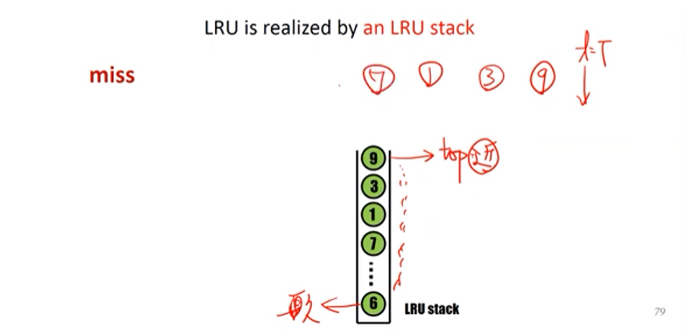

# Chapter 10
- [**Chapter 10-1: Background**](https://www.youtube.com/watch?v=mB2OdZYruFk&list=PLwD0kbgjHKhHaUh1mnJIuwm6otLQW3_UP&index=70)
- [**Chapter 10-2: Demand Paging-1**](https://www.youtube.com/watch?v=bn34DqK_2QU&list=PLwD0kbgjHKhHaUh1mnJIuwm6otLQW3_UP&index=71)
- [**Chapter 10-2: Demand Paging-2**](https://www.youtube.com/watch?v=h27STlhrljo&list=PLwD0kbgjHKhHaUh1mnJIuwm6otLQW3_UP&index=72)
- [**Chapter 10-2: Demand Paging-3**](https://www.youtube.com/watch?v=4zgxz7H-Ns0&list=PLwD0kbgjHKhHaUh1mnJIuwm6otLQW3_UP&index=73)
- [**Chapter 10-3: Copy on Write-1**](https://www.youtube.com/watch?v=YeX14DZme4k&list=PLwD0kbgjHKhHaUh1mnJIuwm6otLQW3_UP&index=74)
- [**Chapter 10-3: Copy on Write-2**](https://www.youtube.com/watch?v=tCtLabG61n8&list=PLwD0kbgjHKhHaUh1mnJIuwm6otLQW3_UP&index=75)
- [**Chapter 10-4: Page Replacement-1**](https://www.youtube.com/watch?v=Afi1Ikb-tLc&list=PLwD0kbgjHKhHaUh1mnJIuwm6otLQW3_UP&index=76)

- [**Chapter 10-4: Page Replacement-2**](https://www.youtube.com/watch?v=cH7iY5QTI9U&list=PLwD0kbgjHKhHaUh1mnJIuwm6otLQW3_UP&index=77)
- [**Chapter 10-4: Page Replacement-3**](https://www.youtube.com/watch?v=PC2_Bgzl21g&list=PLwD0kbgjHKhHaUh1mnJIuwm6otLQW3_UP&index=78)
- [**Chapter 10-4: Page Replacement-4**](https://www.youtube.com/watch?v=YI211rgshfo&list=PLwD0kbgjHKhHaUh1mnJIuwm6otLQW3_UP&index=79)
## Virtual Memory Background

- 不該把整個程式碼傳入記憶體
    - **處理 errors 的程式** (不會被執行到那白做了)
    - Array, list, tables 這些一開始宣告很大但不會被存去到的 → 浪費記憶體空間
    - 特定很少使用 options 跟 features E.g. Word & PowerPoint
- Sol.
    - 載入一部分的程式就好
    - 優點
        - 程式不受限 physical memory 的大小
        - 更少記憶體空間被需要，允許更多 processes 執行
        - I/O 變少了，之前要把所有 pages 都載入記憶體，現在做 swap 跟載入的變少了，因此也比較快

    

        
    

## Demand Paging

- 當「**需要的時候才**」把 page 從硬碟搬到記憶體
- 發生 Page Fault 後 **Page In**
- **Page Fault**:  假設存取 Page 的時候發現他不在記憶體裡面
- **Swapper and Pager**: Swapper: 搬動一整個 process; Pager: 有需要的時候搬 page
- **Page out 時候放哪裡?**
    - 放在 secondary memory (disk partition: swap space or backing store)

- **使用 free frame list**:
    - 當 page fault 時，拿出來用
    - 當 stack 跟 heap 擴增 : hole 在 stack 跟 heap 之間的被填滿時將會使用 free frame list 配置空間

- **zero-fill on demand**
    - 配置之前 zero-out ( 用 0 填滿 )
    - 怕留下**之前 process 的資料在裡面**，因此需要消除

- **了解如何 page 在記憶體裡面**
    - **Hardware Support (MMU)** : **valid-invalid bit** (當時使用 memory protection)，**現在用記憶體管理**
        - invalid: page fault
        - 搬移動作 OS 搬移的，Page Table OS 維護
- **Page Fault Handling**
    1. 若 valid-invalid bit 是 0 → invalid → 觸發 Trap → 
    2. 跳到 OS
    3. Invalid Reference → terminate 
       不在記憶體裡面 → Page In
    4. Free Frame List 找一個 Free Frame，Page 從硬碟搬到記憶體裡 
    5. OS 修改 Page Table $P_i$, frame number 填寫與 valid bit = 1
    6. Restart the instruction
- **Demand Paging 可行的前提**
    - 不要太多 page faults → 否則要一直去硬碟抓資料
    - 程式執行基本上不會產生太多 page faults: 因 ***Locality of Reference*** Demand Paging 的效能不會太差
- **Locality of Reference**
    - **Temporal Locality**: **近期使用到**的指令容易被重複執行
    - **Spatial Locality**: **附近的資料**容易被存取

- **Page Fault Rate**\
    p = 0, no page faults\
    p = 1, every reference is a page fault
## Copy on Write
- **Problems of fork**
    - Copy memory → 浪費時間
    - 但 copying 搞不好不需要，假設呼叫 exec 就會**蓋過去**
- **Do no copy**: page table 指向同個空間
- **Copy on write**: 
    - 呼叫 exec 時代表不能再共享了，指向新的
    - 假設寫了變數就不能在共享了，要**複製再共享**
## Implementation of Copy on Write
- MMU 偵測
- OS 處理 Copy-on-write
    - Copy-on-write bit: 1 → 需要 copy 接著重做一遍才能 write
    - **流程**: 
        - Parent 跟 Child 共享 page frames
        - 所有除了程式碼的 pages 標記 copy-on-write
        - 若 parent 或 child 寫入 page, protection exception 會被觸發
        - CPU 跳到 OS
        - Restart the write operation

## Page Replacement
- Procedure
    1.  找到 free frame: 選擇 victim frame 並且寫入到 disk 裡面
    2.  **更改 Page 跟 Frame Tables**: 改成 **invalid**
    3.  將想要的 Page 讀進 Free Frame
    4.  更新 Page 跟 Frame Tables: 改成 **valid**
    5.  重啟 Process

- **Two Page Transfers**
    - Dirty/ Modify Bit
        - Hardware 設定的，如果該 frame page 被修改
        - Reduce overhead: 只有 modified pages 才會被寫入 disk: m = 1, 寫入，m = 0, 直接取代(不用 page out)
        - 省去一次的 page transfer

## FIFO
- 第一進來的剔掉
- Belady Anomaly: **記憶體變多反而 page faults 上升**
  

        
    

## Optimal
- 取代最久沒用的 Page 
- **最少的 Page Fault Rate**
- 困難實作: 要知道未來最久以後才會用到的

## LRU(Least Recently Used)
- 取代**還沒被使用最久的 Page**
    - 使用逼近
    - 用近期來推知未來

### Counter
- Page Table 新增 **time-of-use bit** (什麼時候存取到) : victim page → 最小 time value 的 page
- 缺點: 
    - O(n)
    - 多寫記憶體一次 → time-of-field 在 page table 裡面
    - overflow of the clock

### Stack
- top 是最近存取的 bottom 是最久存取的
- 假設我存取到就移到最上面
- 不用 search
- page numbers 在 doubly linked list
  

    
    

### Counter 跟 Stack 都需要大量硬體支持
- 更新 clock field 或者 更新 stack 每次 memory reference
- 導致我們需要逼近 LRU 

### Stack Algorithm
- 假設 Physical Memory 有 n frames，變成 n + 1 之後， n frames 仍保留

- Optimal 跟 LRU 都是 Stack Algorithm

### LRU-approximation
- 因 LRU 需要 hardware support 且很少系統有提供足夠的 support
#### Additional-Reference-Bits-Algorithm
- ***Ans: Reference Bit***
    - 一開始設為 0
    - 每次存取就設置成 1\
    (不知道順序)
    - 當 page replacement 發生 → 設置 0
- **Additional Reference Bits**
    - Idea
        - Additional Ordering info
        - history bits in a tablein memory
    - 流程
        - 每次 **shift right** 並補在最高位元，**最低位元踢出去**
        - 8 bits 代表 8 秒內有哪些 page 被存取
        - 找數字最小的 (存取最少的)
#### Second-Chance Algorithm (Clock Algorithm)
- FIFO + reference bit
- FIFO
    - reference bit 為 1 → 給第二次機會，但 reference bit 改成 0 → 往下找
    - reference bit 為 0 踢掉
#### Enhanced Second Chance Algorithm
- (reference bit, modify bit):
    - (0, 0): 不用寫硬碟可以踢(最佳)
    - (0, 1)
    - (1, 0): replacement overhead 低
    - (1, 1): 剔除還要寫硬碟(最差)

### Counting Algorithm
- **count number of references**
- LFU (least frequently used): 最少使用到的剔除

- counting based 很少用\
<strong><mark>a 之前被存取 100 次 之後再也沒用到的話就不適合</mark></strong>