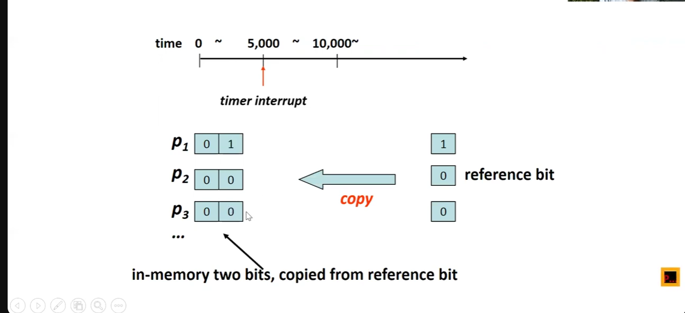
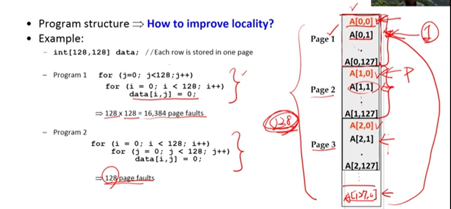

# Chapter 10
- [**Chapter 10-1: Background**](https://www.youtube.com/watch?v=mB2OdZYruFk&list=PLwD0kbgjHKhHaUh1mnJIuwm6otLQW3_UP&index=70)
- [**Chapter 10-2: Demand Paging-1**](https://www.youtube.com/watch?v=bn34DqK_2QU&list=PLwD0kbgjHKhHaUh1mnJIuwm6otLQW3_UP&index=71)
- [**Chapter 10-2: Demand Paging-2**](https://www.youtube.com/watch?v=h27STlhrljo&list=PLwD0kbgjHKhHaUh1mnJIuwm6otLQW3_UP&index=72)
- [**Chapter 10-2: Demand Paging-3**](https://www.youtube.com/watch?v=4zgxz7H-Ns0&list=PLwD0kbgjHKhHaUh1mnJIuwm6otLQW3_UP&index=73)
- [**Chapter 10-3: Copy on Write-1**](https://www.youtube.com/watch?v=YeX14DZme4k&list=PLwD0kbgjHKhHaUh1mnJIuwm6otLQW3_UP&index=74)
- [**Chapter 10-3: Copy on Write-2**](https://www.youtube.com/watch?v=tCtLabG61n8&list=PLwD0kbgjHKhHaUh1mnJIuwm6otLQW3_UP&index=75)
- [**Chapter 10-4: Page Replacement-1**](https://www.youtube.com/watch?v=Afi1Ikb-tLc&list=PLwD0kbgjHKhHaUh1mnJIuwm6otLQW3_UP&index=76)

- [**Chapter 10-4: Page Replacement-2**](https://www.youtube.com/watch?v=cH7iY5QTI9U&list=PLwD0kbgjHKhHaUh1mnJIuwm6otLQW3_UP&index=77)
- [**Chapter 10-4: Page Replacement-3**](https://www.youtube.com/watch?v=PC2_Bgzl21g&list=PLwD0kbgjHKhHaUh1mnJIuwm6otLQW3_UP&index=78)
- [**Chapter 10-4: Page Replacement-4**](https://www.youtube.com/watch?v=YI211rgshfo&list=PLwD0kbgjHKhHaUh1mnJIuwm6otLQW3_UP&index=79)
- [**Chapter 10-5: Page Replacement-5**](https://www.youtube.com/watch?v=TVpBx63trhI&list=PLwD0kbgjHKhHaUh1mnJIuwm6otLQW3_UP&index=80)
- [**Chapter 10-6: Allocation of Frames**](https://www.youtube.com/watch?v=2n8Cm6K3PJo&list=PLwD0kbgjHKhHaUh1mnJIuwm6otLQW3_UP&index=81)
- [**Chapter 10-7: Thrashing-1**](https://www.youtube.com/watch?v=7ANOznENOk0&list=PLwD0kbgjHKhHaUh1mnJIuwm6otLQW3_UP&index=82)
- [**Chapter 10-7: Thrashing-2**](https://www.youtube.com/watch?v=MH9AWdd3iTY&list=PLwD0kbgjHKhHaUh1mnJIuwm6otLQW3_UP&index=83)
- [**Chapter 10-8: Memory Compression**](https://www.youtube.com/watch?v=vChAS5UjcW4&list=PLwD0kbgjHKhHaUh1mnJIuwm6otLQW3_UP&index=86)
- [**Chapter 10-9: Allocating Kernel Memory-1**](https://www.youtube.com/watch?v=8g0MQIbYQuo&list=PLwD0kbgjHKhHaUh1mnJIuwm6otLQW3_UP&index=86)
- [**Chapter 10-9: Allocating Kernel Memory-2**](https://www.youtube.com/watch?v=3ehU4qjjkg0&list=PLwD0kbgjHKhHaUh1mnJIuwm6otLQW3_UP&index=87)
- [**Chapter 10-9: Allocating Kernel Memory-3**](https://www.youtube.com/watch?v=1rwJ2xVpRrc&list=PLwD0kbgjHKhHaUh1mnJIuwm6otLQW3_UP&index=88)

- [**Chapter 10-10: Other Considerations-1**](https://www.youtube.com/watch?v=XOKJTZ1r5yw&list=PLwD0kbgjHKhHaUh1mnJIuwm6otLQW3_UP&index=89)

- [**Chapter 10-10: Other Considerations-2**](https://www.youtube.com/watch?v=3RX_9KZEAt0&list=PLwD0kbgjHKhHaUh1mnJIuwm6otLQW3_UP&index=90)
- [**Chapter 10-10: Other Considerations-3**](https://www.youtube.com/watch?v=TfVzz661pMg&list=PLwD0kbgjHKhHaUh1mnJIuwm6otLQW3_UP&index=91)
## Virtual Memory Background

- 不該把整個程式碼傳入記憶體
    - **處理 errors 的程式** (不會被執行到那白做了)
    - Array, list, tables 這些一開始宣告很大但不會被存去到的 → 浪費記憶體空間
    - 特定很少使用 options 跟 features E.g. Word & PowerPoint
- Sol.
    - 載入一部分的程式就好
    - 優點
        - 程式不受限 physical memory 的大小
        - 更少記憶體空間被需要，允許更多 processes 執行
        - I/O 變少了，之前要把所有 pages 都載入記憶體，現在做 swap 跟載入的變少了，因此也比較快

    

        
    

## Demand Paging

- 當「**需要的時候才**」把 page 從硬碟搬到記憶體
- 發生 Page Fault 後 **Page In**
- **Page Fault**:  假設存取 Page 的時候發現他不在記憶體裡面
- **Swapper and Pager**: Swapper: 搬動一整個 process; Pager: 有需要的時候搬 page
- **Page out 時候放哪裡?**
    - 放在 secondary memory (disk partition: swap space or backing store)

- **使用 free frame list**:
    - 當 page fault 時，拿出來用
    - 當 stack 跟 heap 擴增 : hole 在 stack 跟 heap 之間的被填滿時將會使用 free frame list 配置空間

- **zero-fill on demand**
    - 配置之前 zero-out ( 用 0 填滿 )
    - 怕留下**之前 process 的資料在裡面**，因此需要消除

- **了解如何 page 在記憶體裡面**
    - **Hardware Support (MMU)** : **valid-invalid bit** (當時使用 memory protection)，**現在用記憶體管理**
        - invalid: page fault
        - 搬移動作 OS 搬移的，Page Table OS 維護
- **Page Fault Handling**
    1. 若 valid-invalid bit 是 0 → invalid → 觸發 Trap → 
    2. 跳到 OS
    3. Invalid Reference → terminate 
       不在記憶體裡面 → Page In
    4. Free Frame List 找一個 Free Frame，Page 從硬碟搬到記憶體裡 
    5. OS 修改 Page Table $P_i$, frame number 填寫與 valid bit = 1
    6. Restart the instruction
- **Demand Paging 可行的前提**
    - 不要太多 page faults → 否則要一直去硬碟抓資料
    - 程式執行基本上不會產生太多 page faults: 因 ***Locality of Reference*** Demand Paging 的效能不會太差
- **Locality of Reference**
    - **Temporal Locality**: **近期使用到**的指令容易被重複執行
    - **Spatial Locality**: **附近的資料**容易被存取

- **Page Fault Rate**\
    p = 0, no page faults\
    p = 1, every reference is a page fault
## Copy on Write
- **Problems of fork**
    - Copy memory → 浪費時間
    - 但 copying 搞不好不需要，假設呼叫 exec 就會**蓋過去**
- **Do no copy**: page table 指向同個空間
- **Copy on write**: 
    - 呼叫 exec 時代表不能再共享了，指向新的
    - 假設寫了變數就不能在共享了，要**複製再共享**
## Implementation of Copy on Write
- MMU 偵測
- OS 處理 Copy-on-write
    - Copy-on-write bit: 1 → 需要 copy 接著重做一遍才能 write
    - **流程**: 
        - Parent 跟 Child 共享 page frames
        - 所有除了程式碼的 pages 標記 copy-on-write
        - 若 parent 或 child 寫入 page, protection exception 會被觸發
        - CPU 跳到 OS
        - Restart the write operation

## Page Replacement
- Procedure
    1.  找到 free frame: 選擇 victim frame 並且寫入到 disk 裡面
    2.  **更改 Page 跟 Frame Tables**: 改成 **invalid**
    3.  將想要的 Page 讀進 Free Frame
    4.  更新 Page 跟 Frame Tables: 改成 **valid**
    5.  重啟 Process

- **Two Page Transfers**
    - Dirty/ Modify Bit
        - Hardware 設定的，如果該 frame page 被修改
        - Reduce overhead: 只有 modified pages 才會被寫入 disk: m = 1, 寫入，m = 0, 直接取代(不用 page out)
        - 省去一次的 page transfer

## FIFO
- 第一進來的剔掉
- Belady Anomaly: **記憶體變多反而 page faults 上升**
  

        
    

## Optimal
- 取代最久沒用的 Page 
- **最少的 Page Fault Rate**
- 困難實作: 要知道未來最久以後才會用到的

## LRU(Least Recently Used)
- 取代**還沒被使用最久的 Page**
    - 使用逼近
    - 用近期來推知未來

### Counter
- Page Table 新增 **time-of-use bit** (什麼時候存取到) : victim page → 最小 time value 的 page
- 缺點: 
    - O(n)
    - 多寫記憶體一次 → time-of-field 在 page table 裡面
    - overflow of the clock

### Stack
- top 是最近存取的 bottom 是最久存取的
- 假設我存取到就移到最上面
- 不用 search
- page numbers 在 doubly linked list
  

    
    

### Counter 跟 Stack 都需要大量硬體支持
- 更新 clock field 或者 更新 stack 每次 memory reference
- 導致我們需要逼近 LRU 

## Stack Algorithm
- 假設 Physical Memory 有 n frames，變成 n + 1 之後， n frames 仍保留

- Optimal 跟 LRU 都是 Stack Algorithm

- <strong><mark style='background-color:red; color: white; padding-left: 2px; padding-right: 3px'>因為 First in first out 導致 Belady Anomaly 音如果 n + 1 還保留 n 的所有 frame，其不會隨著 frame 數量提升導致 page faults 數量增加</mark></strong>

- <strong><mark style='background-color:red; color: white; padding-left: 2px; padding-right: 3px'>Optimal 跟 LRU n 到 n + 1 時還是會保留 n 的所有內容</mark></strong>

## LRU-approximation
- 因 LRU 需要 hardware support 且很少系統有提供足夠的 support
### Additional-Reference-Bits-Algorithm
- ***Ans: Reference Bit***
    - 一開始設為 0
    - 每次存取就設置成 1\
    (不知道順序)
    - 當 page replacement 發生 → 設置 0
- **Additional Reference Bits**
    - Idea
        - Additional Ordering info
        - history bits in a table in memory
    - 流程
        - 每次 **shift right** 並補在最高位元，**最低位元踢出去**
        - 8 bits 代表 8 秒內有哪些 page 被存取
        - 找數字最小的 (存取最少的)
### Second-Chance Algorithm (Clock Algorithm)
- FIFO + reference bit
- FIFO
    - reference bit 為 1 → 給第二次機會，但 reference bit 改成 0 → 往下找
    - reference bit 為 0 踢掉
### Enhanced Second Chance Algorithm
<mark style='background-color:red; color: white; padding-left: 2px; padding-right: 3px'>read 會設定 reference bit 1; write 會設定 reference bit 跟 modify bit 為 1;</mark>
- (reference bit, modify bit):
    - (0, 0): 不用寫硬碟可以踢(最佳)
    - (0, 1): <mark style='background-color:red; color: white; padding-left: 2px; padding-right: 3px'>已經錯過 first chance 的 (1, 1)</mark>
    - (1, 0): replacement overhead 低，<mark style='background-color:red; color: white; padding-left: 2px; padding-right: 3px'>read 的狀況</mark>
    - (1, 1): 剔除還要寫硬碟(最差)，<mark style='background-color:red; color: white; padding-left: 2px; padding-right: 3px'>write 的狀況</mark>

## Counting Algorithm
- **count number of references**
- LFU (least frequently used): 最少使用到的剔除

- counting based 很少用\
<strong><mark>a 之前被存取 100 次 之後再也沒用到的話就不適合</mark></strong>

## Page Buffering Algorithms
- **Original Page Replacement**: 記憶體都滿了，選個 victim 踢掉:
    - 寫一次硬碟(存取硬碟)
    - 改 Valid-invalid bit
    - Page in(存取硬碟)
    - 改 Page Table \
    → <mark>很長等待在 waiting</mark>
- **維護 Free Frame**: 
    - **A pool of free frames**: free memory 小於 threshold 的時候就會做 page  replacement (不會等到都沒有才觸發)
    - Dirty Pages 先寫回去硬碟，Page Fault 就可以蓋過去
    - <strong><mark style='background-color:red; color: white; padding-left: 2px; padding-right: 3px'>記得原本的 free frame 存哪些 Page，這樣我下次存取就可以重複使用</mark></strong>
        

            
        

    
## Allocation of Frames
- Global Replacement
    - 在所有 frames 裡面選一個替換
    - **Bad**:  沒辦法控制 fault rate → 會被其他 processes 影響
- Local Replacement
    - 只能在自己的 frames 裡面選一個替換
    - **Bad**: 有些 frames 在其他 processes 的很少被使用到卻**不能被替換** (犧牲 paging的優點之一)
<strong><mark> Global Replacement: 更常見 → better throughput</mark></strong>\
 ( •̀ ω •́ )✧

- **Global Page-Replacement Policy**
    - free frame list 低於 minimum threshold 時，**Kernel Routine "*Reapers*" 回收 Pages**
        - 其把 Page 踢掉來讓出 Page 空間
    - free frame list 大於 maximum threshold 時就不在執行 **Reaper**
    - 確保有至少 minimum threshold 的 memory 去滿足新的 request
    

        
    

    <strong><mark style='background-color:red; color: white; padding-left: 2px; padding-right: 3px'>之所以要保留 minimum 的 free frames 是因為我有空的可以直接 Page in，剔除的可以平行執行不需要 sequentially 的 Page out</mark></strong>
    

## Thrashing
- **Process 太少記憶體空間 → Page Fault Rate 太高**
    - Low CPU utilization → OS 誤判
        - Increased Degree of Multiprogramming
        - More processes added to the system
        <mark>低利用率讓 OS 覺得要執行更多 Process → 問題更嚴重</mark>
        

            
        

        
    - <strong><mark>定義: 若 process 花太多時間在 paging (page in page out) 多於「執行」</mark></strong>

### Reference of Locality

- **Locality**: a set of pages that are actively used
- 當 Process 執行時不同時間點上有**不同 locality**
- 足夠的 frame 去包含 localities 就不會有 thrashing

### Working-Set Model
- working-set window: $\Delta$ (delta) 
- working set: a set of pages in most recent $\Delta$ page references

 

            

- 計算
    - $D = \Sigma \,\,\text{WSS}_i \equiv \text{total working sets for all processes}$
    - $\text{m} = \text{total frames in memory}$
    - $D \ll m, \text{increase the number of multiprogramming}$
    - $\text{if } D > m$ → thrashing
- <strong><mark>追蹤 WSS at each memory reference 不簡單 → 逼近 </mark></strong>
    - OS 不知道 CPU 存取記憶體
### Approximate Working Set
- **Interval timer + Reference bit**
  - 知道哪段時間有哪些被存取 (two in-memory bits copied from reference bit) 也可以更多 bits
- 困難點: 決定 delta
    - $\Delta$ 太少，很難包含整個 Locality
    - $\Delta$ 太多，給太多空間給 Locality，包含太多

            

此時有 P1

### Page-Fault Frequency

- Thrashing 有很高 Page Fault Rate 
- Page Fault Rate 高 → 給多點記憶體空間
- Page Fault Rate 低 → 拿回記憶體空間
 

            

 
## Memory Compression
- Paging Version
    - Free Frame list
    - Modified Frame List
    - <mark>太少 free frame 我就把 modified frame list寫回記憶體來清空間</mark>
- Memory Compression Version
    - Compressed Frame List: 從 free frame list 裡面**拿一個 free frame 去把 modified frame list 的資料壓縮存放** → 以此釋放更多空間

## Allocating Kernel Memory
- 使用者要求
    - malloc(): 從 free frame list 裡面去分配 
    - 現象:
        - 不連續
        - internal fragmentation 
- Kernel 要求
    - **Another-Free-Memory Pool** 分配:
        - Kernel 使用 Data Strcuture 才要空間\
            E.g. 很需要動態產生 PCB TCB 封包 等
            - Kernel code 跟 data **不能 Paged out 因為常常被使用，處理 Page in/out的程式碼需被保留否則就沒辦法做指令了**, internal fragmentation 浪費記憶體
        - 有些 kernel memory 需要 physically contiguous，因有些硬體需要連續記憶體跟OS互動\
        e.g. 硬碟如果用 Physical Address 直接存取就不能用 Paging 代表空間一定要連續
## Buddy System
- 分配用 $2^n$ (power-of-2 allocator)
- 小的分配需要時我就把 chunck 切成兩個 next-lower power of 2
- Coalescing 空白 Merge

 

            

## Slab Allocation
- Slab
    - 一個或更多 contiguous 的 frames
    - 指定給特定 cache

- Cache
    - 包含一個或更多 caches
    - 每個 cache 都用來做特別的 data structure\
    $\text{1 slabs} = 3\text{  frames}\newline
    \text{2 slabs} = 6 \text{ frames}\newline
    \text{a cache} = 2 \text{ slab} = 24\text{ KB}\newline
    \text{PCB}  = 2 \text{ KB}\newline
    \text{a cache can stores 12 PCB}$
### 優點
- No fragmentation
- Fast memory request satisfation 
    - object已經事先 create
    - 用完就弄成 free 但還在 cache 裡面

## Other Considerations
### Pre-paging
- 一開始的時候 (start-up) 都會產生**大量的 Page Fault**
- Pre-page 預先 page 一個 process 需要的
- 假設沒用到那 I/O 跟記憶體都**浪費掉**
- Prepage 執行擋比較難，因為執行的時候會**跳來跳去**讓預測不容易
- Prepage Data File 容易，他們循序存取，比較可預測

### Page Size
- Page Table Size (memory overhead) → **希望 Page Table 小，也是 Page 大一點來減少 Entry 數量**
- Internal Fragmentation (memory utilization) → **小 Page** 🤔
- I/O overhead → 大 Page
- Better Resolution (Locality) → small page
    - 假設 Locality 100 KB 但 Page Size 200 KB，那沒辦法抓住 Locality，因此希望小
- Number of Page Faults → 大 Page，這樣 Page Fault 少 😱

- **趨勢**
    - ***Ans: 大***
        - 希望不要存取**硬碟**
        - 重視 I/O overhead 跟 number of page faults (page fault 太昂貴)

### TLB Reach
- TLB 可以 access 的 memory
    - TLB Reach = (TLB Entries) $\times$ (Page Size)
    - 希望 working set 的 processes 都在 TLB 這樣就不會 **TLB miss**
- **增加 TLB Reach**
    - 增加 TLB entries (貴且耗電)
    - 增加 Page Size (目前) → Internal Fregmentation
    - *提供不同 Page Sizes*

### Program Structure
- 改善 Locality: 程式一次經過太多 Pages，記憶體不能記住太多

    

        
    

- Data Structures:
    Pointers, Hash: Poor Locality (很遠)
    Stack: Good Locality
- I/O Interlock & Page Lock
    - Sol-1
        - 封包送到已經 Paged out 的
        - 規定 I/O 資料 OS 代收，OS 知道 P1 被剔除，因此 OS 不會亂送
        - 缺點: 多一次記憶體 copy (目前還都這麼做)
    - Sol-2
        - Page 設定 lock bit 讓他不會踢出去