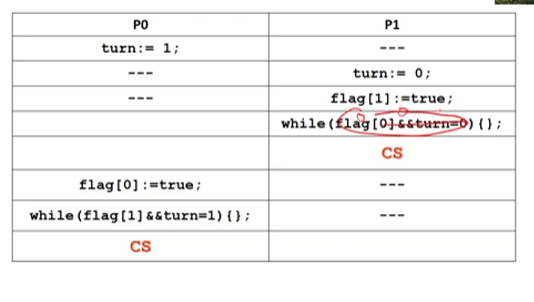
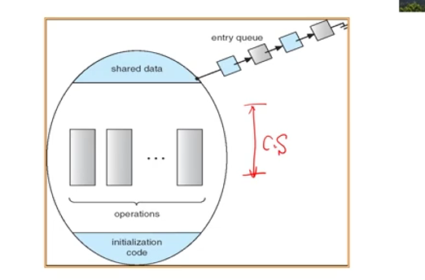
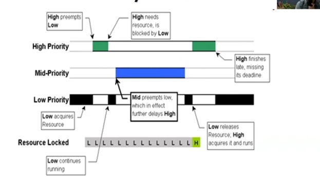

# Chapter 6

- [**Chapter 6-2: The Critical Section Problem**](https://www.youtube.com/watch?v=tJZqLFqZHsk&list=PLwD0kbgjHKhHaUh1mnJIuwm6otLQW3_UP&index=37)
- [**Chapter 6-3: Peterson's Solution**](https://www.youtube.com/watch?v=WRzQYK0e1dk&list=PLwD0kbgjHKhHaUh1mnJIuwm6otLQW3_UP&index=38)
- [**Chapter 6-4: Hardware Solution-1**](https://www.youtube.com/watch?v=9QdSE-06De0&list=PLwD0kbgjHKhHaUh1mnJIuwm6otLQW3_UP&index=39)
- [**Chapter 6-4: Hardware Solution-2**](https://www.youtube.com/watch?v=q3SCort5KoU&list=PLwD0kbgjHKhHaUh1mnJIuwm6otLQW3_UP&index=40)
- [**Chapter 6-4: Hardware Solution-3**](https://www.youtube.com/watch?v=KlK7Ww96W7s&list=PLwD0kbgjHKhHaUh1mnJIuwm6otLQW3_UP&index=41)

- [**Chapter 6-5: OS Solutions-Mutex Lock & Spin Lock**](https://www.youtube.com/watch?v=zJ7i3JZ_ubQ&list=PLwD0kbgjHKhHaUh1mnJIuwm6otLQW3_UP&index=42)

- [**Chapter 6-6: OS Solutions-Semaphores**](https://www.youtube.com/watch?v=oZlkGhxAEw8&list=PLwD0kbgjHKhHaUh1mnJIuwm6otLQW3_UP&index=43)

- [**Chapter 6-7: Language Level Solutions-Monitor-1**](https://www.youtube.com/watch?v=tkLx4ETsLhw&list=PLwD0kbgjHKhHaUh1mnJIuwm6otLQW3_UP&index=44)

- [**Chapter 6-7: Language Level Solutions-Monitor-2**](https://www.youtube.com/watch?v=ztJ9ncJKv2g&list=PLwD0kbgjHKhHaUh1mnJIuwm6otLQW3_UP&index=45)

- [**Chapter 6-8: Liveness**](https://www.youtube.com/watch?v=iCh_sUe60Y4&list=PLwD0kbgjHKhHaUh1mnJIuwm6otLQW3_UP&index=46)
- [**Chapter 6-9: Evaluations**](https://www.youtube.com/watch?v=9J_N-2kQ904&list=PLwD0kbgjHKhHaUh1mnJIuwm6otLQW3_UP&index=47)
## The Critical Section problems
- 定義
    -  n processes 在爭奪使用 shared data
    - 每個 process 有使用 shared data 的 code segment $\rightarrow$ critical section(CS)
    - **Entry Section**: 在 CS 之前 process 需要要求使用 CS
    - **Exit Section**: 在 CS 之後，process 必需要 release 要求
    - **Remainder Section**: 剩下不影響 shared data 的程式

- 目標
    - 當一個 process 能夠執行 *CS*
    - 沒有其他 processes 能夠**同時**進入 *CS*


- 滿足條件
    - **Mutual Exclusion**: **只能一個** process 在**任何時間點**能夠在 CS (critical section)
    - **Progress**: 
        - 假設沒有 progress 在 CS 裡面，並且**有些 processes** 想進去 $\rightarrow$  只有這些沒有在 remainder section 的才能參與決策
        - 選擇 processes **不能被無限延遲** ($\rightarrow$ 有限時間內要選出來)

    - Bounded Waiting
        - bound 存在讓其他 processes 可以進入 CS 的次數
        - 確保 process **會被選擇**進入 CS (or starvation)

## Peterson's Solution
- Characteristics
    - 不見得在當今架構能夠成功
    - Two-Process Solution
    - LOAD and STORE CPU 都要是 Atomic
    - **Varaibles**
        |variable(s)|type|description|
        |:-:|:-:|:-:|
        |turn|int|決定誰進入 critical section|
        |flag[]|boolean[2]|決定哪個 process 準備好進入 critical section|
    - **Code**\
        $P_0$
        ```c
            // start of entry section
            flag[i] = true; // want in
            turn = j; // yield access
            while(flag[j] && turn == j);
            // end of entry section
            // critical section
            flag[i] = false; // exit section
            // remainder section 
        ```
        \
        $P_1$
        ```c
            // start of entry section
            flag[j] = true; // want in
            turn = i; // yield access
            while(flag[i] && turn == i);
            // end of entry section
            // critical section
            flag[j] = false; // exit section
            // remainder section 
        ```
    - work 的原因: 
        - flag 紀錄是否表示要進入，就算兩個隨時切換，此紀錄都不會被蓋掉
        - turn 表示讓出，就算 context switch 到我或到對方我都會讓出做 waiting，**最多雙方互讓一次**就會進去 CS
        - 讓出之後 context switch 回來讓出的狀態會讓對方 waiting
        - release 之後 解除 want-in 使得 waiting 破裂，完成 exit section
    - turn 跟 flag 不能對調: 對方還沒 ready 就先讓給我 那我讓給他之後會做 CS 因為對方還沒 ready，換到對方時對方 ready 了又會做
    <center></center>

    - 缺點
        - 容易出錯
        - 在當今電腦不見得會 work: **因為當前電腦 processors 或 compilers 也許會 *reorder operations* 導致我 turn 跟 flag 對調** $\rightarrow$ 發生在 **multi-threaded systems**.\
        <mark><strong>可能對調之後執行速度比較快</strong></mark>
        - two-process solution
        - 要求進入的 process 在 **busy waiting** $\rightarrow$ 花太多 processor 的時間且如果等太久，直接 block processes 比較**有效率**
## Hardware's Solution
### Disable Interrupts
- **Uniprocessors**: Disable interrupts
    ```
    disable interrupts
        CS
    enable interrupts
        remainder
    ```
    - without preemption
    - **only available** to the kernel: \
        cli 等等指令，是 **privileged instruction**，但應用程式沒辦法用來解決 race condition
    - 不夠 multiprocessor systems 使用
        - 只有關掉一個 core 的 interrupt
        - 其他 **core 還會用 critical section**
### Memory Barriers
- Memory barrier or memory fences
    - 強迫 code 按照順序
    - fence 之前跟之後的順序會維持
    - ***Disable Reordering***

- 缺點
    - Peterson's **繼承**的三個問題

    - 開發 low-level machine code才會用
    - 只會被 OS 開發者使用
### Locks
- 主流做法
- mutual exclusion
- Procedure
    - **acquire lock**: lock = 0, set lock = 1, enter CS
    - **release lock**: lock = 0
- Code
    ```c
    while(lock != 0);
    lock = 1; // lock the gate
        CS
    lock = 0; // unlock the gate
    ```
    - 因 lock 是 **shared variable** lock = 1 不能自己做
    
    |Thread 1|Thread 2|
    |:-:|:-:|
    |`while(lock != 0)`|---|
    |`mov eax, 1`|---|
    |---|`while(lock!=0)`|
    ||`mov eax, 1`|
    |`mov lock, eax`||
    |<strong style='color:red'>CS</strong>||
    |---|`mov lock, eax`|
    ||<strong style='color: red'>CS</strong>|
    - Acquire lock needs to execute ***Atomically***

- <mark><strong>Atomic: non-interruptable</strong></mark>
#### *test_and_set*
```c
    bool test_and_set(bool *target)
    {
        bool rv = *target;
        *target = true;
        // 把 lock 設為 1
        return rv;
    }
    // 整個 instruction 都是 atomic
```
- 更新 lock
    ```c
    while(test_and_set(&lock));
        // critical section
    lock = false;
        // remainder section
    ```
#### *compare_and_swap*
```c
    void compare_and_swap(int* value, int expected, int new_value)
    {
        int temp = *value;
        if(*value == expected)
            *value = new_value;
        return temp;
    }
```
- 更新 lock
```c
    while(compare_and_swap(&lock, 0, 1) != 0);
        // critical section
    lock = 0; // 不用同步
        // remainder section
```
- bounded waiting 兩者都不符合，因 $P_i$ 可以重複進入 CS
#### *Sol: bool waiting[n]*
waiting[i] = 1;
initialized to false

```c
    waiting[i] = true;
    while(waiting[i] && test_and_set(&lock));
    waiting[i] = false;
        // CS
    // exit section
    j = (i + 1) % n;
    while( (j != i) && waiting[j] == false)
        j = (j + 1) % n;

    if(j == i) lock = false; //繞一圈沒有人要做，設 lock 為零
    else waiting[j] = false; // 否則接力棒給你做，lock 再幫你鎖住給你解
```
### Atomic Variables
- compare_and_swap 跟 test_and_set **都是 building blocks**
- 使用 **atomic (uninterruptible) updates** 來更新 **basic data types**

- 系統如果要支援 atomic variables 需要
    - **Atomic data types**
    - **Special functions**\
    **來存取** atomic variables
    - E.g. 
        ```c
        void increment(atomic_int* v){
            int temp;
            do{
                temp = *v;
            }
            while(temp != compare_and_swap(v, temp, temp + 1));
            // compare_and_swap 如果跟 expected 相等我就更新，如果 variable 被更新了，temp 數值就會跟 *v 不一樣，啟動迴圈 temp 再給 *v 指定
        }
        increment(&counter)
        
        ```
    - 沒有完全解決 race condition 問題
        - **A limited set of operations to basic data type**
        - E.g. red-black tree
    
## OS-solution
- hardware-based 太過複雜
    - Memory Barriers
    - Hardware Instructions
    - Atomic Variables
- OS 提供「方便方法」
### Mutex Locks
- **mutex**: `bool` variable, default = 1 (代表**一開始可以進入 CS**)
- 只能夠用 2 個 atomic functions 來存取:
    - acquire()
    - release()\
    <mark><strong>使用 test_and_set() & compare_and_swap() 去包裝</strong></mark>

- **code**:
    - **acquire**:
    ```c
        void acquire(){
            while(mutex == false);
            mutex = false;
        }
    ```
    - **release**:
    ```c
        void release(){
            mutex = true:
        }    
    ```
    - Put together:
    ```c
        acquire(mutex);
        // CS
        release(mutex);
        // remainder section
    ```
### Spin Lock 課本上說跟 mutex lock 一樣 但實作一模一樣 (不考) 
(Optional)

---
- 前言
    - let process/ thread waiting 等待東西好再說 acquire() 失敗就去睡覺
    - 不用 busy waiting
    - busy waiting 在某些狀況下為比較好的選擇
    - 如果 CS 很短的話 busy waiting 比較好因為沒有 **context switch overhead**，如果很長的話使用**sleep**
    - single processor 的話你等他不做，因此建議 sleep，MP 的話使用 busy waiting
- 結論: 不知道 spin lock (講義上說是 busy waiting) 但不知道到底跟 mutex lock 有啥差
---

### Semaphores
- $S$ : *integer variable*
- 只能用 wait 跟 signal 來存取
    - **wait**
        
        $\text{wait (S) : \{}\\
        \qquad\text{while S} \leq 0\,;\\
        \qquad S \text{ - - };\\
        \}$
    - **signal**
    
        $\text{signal (S) : \{}\\
        \qquad\ S \text{ + + };\\
        \}$

- 沒有兩個 processes 能夠在**同個 semaphore 上同時執行** signal() 跟 wait()
---
#### Counting Semaphore
- 數值: unrestricted integer value
- 頂多 $n$ processes 可以存取
#### Binary Semaphore
- 像是 mutex
- 初始化成 1
---

#### Synchronize process
- **Def**:

    ---
    $\text{Let } P_1 \text{ addresses } S_1 \\ \text{and } P_2 \text{ addresses } S_2 \\$
    $\text{synch}: 0\\$ 
    $S_1$ 先 $S_2$ 後，那

    $P_1:\\ \quad S_1;\\\quad \text{signal(synch);}\\ P_2:\\ \quad \text{wait(synch);}\\ \quad S_2;$

    ---
- 能夠確保 $S_1$ 先跑，因如果 $S_2$ 先跑就會 **waiting**

#### Implementation
- 不想要 **Busy Waiting**
- **定義 waiting queue**
    ```c
        typedef struct{
            int value;// value of the semaphore
            struct process* L; // waiting queue
        } semaphore;
    ```
- **定義 functions**\
    $
        \text{wait(S) : } \\
        \qquad \text{S.value - - ;} \\
        \qquad \text{if (S.value < 0)}\{\\
            \qquad\qquad \text{add this process to S.L ;}\\
            \qquad\qquad \text{block ; }\\
        \qquad\}
    $\
    $
        \text{signal(S) : }\\
        \qquad\text{S.value++}\\
        \qquad\text{if} (\text{S.value} \leq 0)\{\\
        \qquad\qquad \text{remove a process P from S.L ; }\\
        \qquad\qquad \text{wakeup(P) ; }\\
        \qquad\}
    $
    - 確保不會有 <strong><mark>兩個 processes 在同個 semaphore 上面同時執行 wait() 跟 signal()</mark></strong> $\rightarrow$ 因為 semaphore 本身也是 **共享變數**，因此需要利用 
        - Uniprocessor: ***disable interrupts***
        - Multicore system: ***compare_and_swap or test_and_set***

## Language Level Solutions
### Monitor
- semaphores 的問題
    - 不正確使用
        - 不正確 order of wait() and signal()
        - replace signal() with wait()
        - omit wait() or signal()
    - Bugs 很難預測

- 提供 Abstraction
- 包括 Private Data 跟 Public Method
- 任何一個時間點**最多只有**一個 process 可以在 monitor 裡面
    - 當一個 process 已經在 monitor 裡面，另一個 process 想進去(呼叫 monitor 裡面函數) $\rightarrow$ 他就會被串進 **entry queue**
<center></center>

- **Condition Variable**: 允許 process 在 monitor 裡面被 block 住
    - **x.wait()**: suspended in condition variable's waiting queue
    - **x.signal()**: resume an suspended; otherwise, no effect. (no addition or subtraction of semaphores)

    - 另 condition x, 當 process A 在呼叫 x.wait() 之後，block 住，接者允許 entry queue 的 process B 進來，接者進來的 process B 呼叫 x.signal()，此時
        - process B 在 monitor 裡面呼叫完 x.signal()
        - process A 在 monitor 內被叫起來\
        <mark><strong>違反只能讓一個 process 在 monitor 裡面的要求</strong></mark>
        - ***Sol:***
            - **signal and wait**\
                B 等到 A 離開
            - **signal and continue**\
                B 繼續執行，A 等到 B 離開

### Monitor Implementation
- **3 cases monitor 會被 blocked**
    - Case 1: entering
        - 使用 semaphore mutex (init as 1)
        - wait(mutex) before entering
        - signal(mutex): after leaving
    - Case 2: x.wait()
        - x_sem (init as 0): x 的 semaphore
        - x_count (init as 0): 有多少 processes 等待在 x_sem
    - Case 3: x.signal() (signal and wait)
        - next (init as 0): 用來 signal 一個 process
        - next_count (init as 0): suspended 在 next 的 processes 數量
- **進入 monitor**

    ```java
    wait(mutex)
        // body of F;
    if (next_count > 0)
        signal(next);
    else
        signal(mutex);
    ```
- **condition variable** 
    ```java
    x.wait(){
        x_count++;
        // 讓別人進來
        if (next_count > 0)
            signal(next);
        else
            // 讓外面的進來
            signal(mutex);
        wait(x_sem);
        x_count--;
    }
    x.signal(){
        if (x_count > 0){
            next_count++;
            signal(x_sem);
            wait(next); 
            // signal and wait
            next_count--;
        }
    }
    ```

## Liveness
- 定義 一個系統需要滿足的 a set of properties 來保證 processes make progress

- Liveness Failure (or liveness hazards)
    - 無法滿足條件
    - 造成 **poor performance & bad responsivenss**
    - 例子:
        - Indefinite waiting
        - Deadlock
        - Priority Inversion
- Priority Inversion
    - 步驟
        - Low Priority 拿到 Resource
        - High Priority prempts low priority
        - High Priority 呼叫 wait，但 Resource 被拿走
        - Low Priority 繼續做
        - Mid-Priority preempt Low Priority
        - Mid-Priority 執行完 給 Low Priority
        - Low Priority 執行到 Release Resource
        - High Priority Prempt 回去 
    - 問題: Mid Priority 拿走 Resource 讓 High Priority 無法使用
    - ***Sol:***
        - High Priority 做 waiting 的時候讓 lower Priority **繼承 Priority 到同等 Level**
        - Low-priority Signal 的時候**降回來** 原本的 Priority

<center></center>

## Evaluation
- **Lock-based: Pessimistic scheme**
    - 先取得 lock 不管會不會發生
- **Lock-free programming: Optimistic scheme**
    - 先執行，發生問題再重新執行

- 什麼時候使用什麼
    - Atomic Variables: overhead 最低，使用簡單 (integers) 變數的時候
    - Spinlock: 再 MP (multiprocessors) 如果 CS 很短那就用
    - Mutex locks: 比 binary semaphores 更少 overhead
    - 很多 resources 的話使用 counting semaphore
    - Read-write locks: 比 mutex lock 好，當需要高度平行度時候
    - Monitor and condition variables: overhead 最高，不適合 highly contended 的狀況

問題    
--- 

<mark style='background-color: red; color:white; padding:4px; border-radius: 5px'><strong>1. 難道 binary semaphore 跟 mutex 不會有 bounded waiting 的問題嗎?</strong></mark>

<mark style='background-color: red; color:white; padding:4px; border-radius: 5px'><strong>
2. 透過 semaphore 實現 monitor 這邊有所謂的 next semaphore，因為之前講到的 semaphore 具備他的一條 waiting queue，是否應該也有一個 waiting queue</strong></mark>

---
