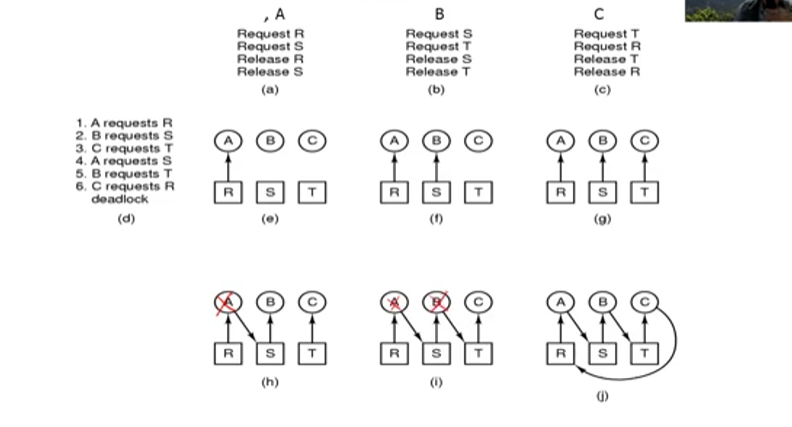
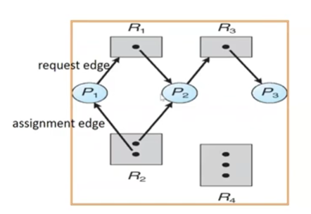
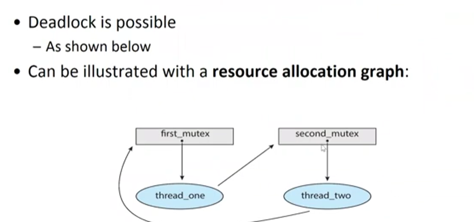

# Chapter 8
<mark style='background-color: red; color:white; padding: 5px; border-radius: 5px'><strong>跟據 上課內容考到 Methods for Handling Deadlocks</strong></mark>

- [**Chapter 8-1: System Model**](https://www.youtube.com/watch?v=19NJru-n5kc&list=PLwD0kbgjHKhHaUh1mnJIuwm6otLQW3_UP&index=51)

- [**Chapter 8-2: Deadlock Characterization**](https://www.youtube.com/watch?v=jAJJyEdKf1M&list=PLwD0kbgjHKhHaUh1mnJIuwm6otLQW3_UP&index=52)

- [**Chapter 8-3: Deadlock Prevention**](https://www.youtube.com/watch?v=22BmKTWpBqA&list=PLwD0kbgjHKhHaUh1mnJIuwm6otLQW3_UP&index=53)

## System Model
### Resource
- $R_1, ..., R_m$ (CPU cycles, Memory, I/O, ect.)

- Resource Type $R_i$ 有 $W_i$ instances

- Thread 要使用 Resource 的步驟
    - Request
    - Use
    - Release

### Deadlock
- 無限 Blocking
    <center></center>
- Deadlock in **Multithreaded Application**
    - Thread 1 執行 
    ```c
        pthread_mutex_lock(&first_mutex);
        pthread_mutex_lock(&second_mutex);
        /*
         * Critical Section
         */
        pthread_mutex_unlock(&second_mutex);
        pthread_mutex_unlock(&first_mutex);
    ```
    - Thread 2 執行
    ```c
        pthread_mutex_lock(&second_mutex);
        pthread_mutex_lock(&first_mutex);
        /*
         * Critical Section
         */
        pthread_mutex_unlock(&first_mutex);
        pthread_mutex_unlock(&second_mutex);
    ```
    - **Resource Allocation Graph**
        <center></center>

        - **Vertex**
            - $\text{P} = \{P_1, P_2, ..., P_n\}, \text{ consisting of all the threads}\newline R = \{R_1, R_2, ..., R_m\}, \text{consisting of all resources types}\newline
            \text{Request Edge  Directed Edge } P_i \rightarrow R_j\newline
            \text{Assignment Edge Directed Edge } R_j \rightarrow P_i$
        <center></center>
- 偵測 Deadlocks
    - 只有在某些情況才會發生因此 **很難被偵測**

### Deadlock characteristics
- Characteristics
    - **Mutual Exclusion**:\
        **一次只有一個 thread** 可以 使用 Resource
    - **Hold and Wait**: 已經**有 Resource** 的 Thread 又在等另一個 Resource
    - **No Preemption**: Resource 不能被搶，只能自願放棄才可 Release
    - **Circular Wait**: 每個 Thread 在等另一個 Thread $\{P_0, P_1, ..., P_n\}, \newline P_i \text{ waits for a resource held by } P_{i+1}\text{ , where i < n.}\newline P_n \text{ waits for a resource held by } P_1$ 
- Resource Allocation Graph with Deadlock\
    沒有 Deadlock 的 Cycles: 可能 Resource Types 多但指向給可以釋放的 Resource 
    - 假設 Graph 沒有 Cycles $\rightarrow$ 一定沒有 Deadlock
    - 假設 Graph 有 Cycles $\rightarrow$ 
        - 如果一個 resource type 只有一個 instance, deadlock
        - 如果一個 Resource type 有好幾個 instances，就有可能 deadlock
    - 整理
        - 命題
            - Deadlock $\rightarrow$ cycle
            - Cycle $\rightarrow$ maybe deadlock
        - 反命題
            - no cycle $\rightarrow$ no deadlock
            - no deadlock $\rightarrow$ maybe deadlock
### Methods for Handling Deadlocks
- Method 1
    - Deadlock prevention
    - Deadlock avoidance
- Method 2
    - Deadlock detection and deadlock recovery
- Method 3
    - Ignore it
