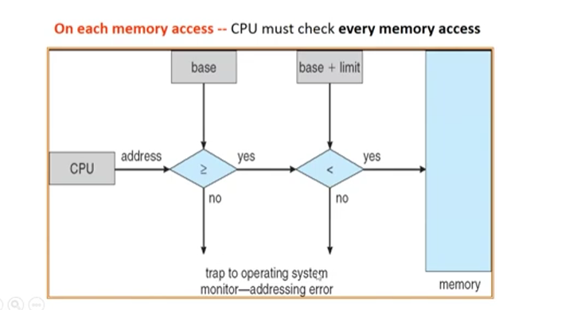
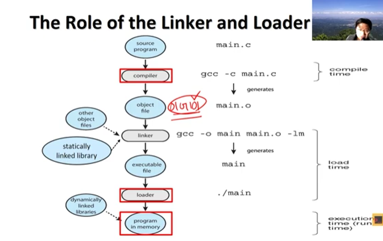
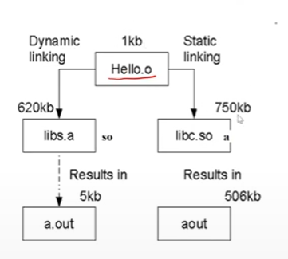
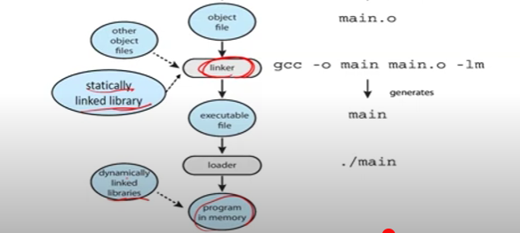
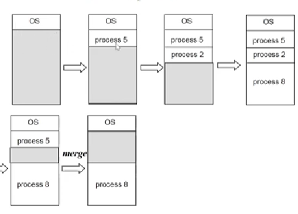
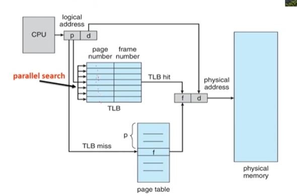
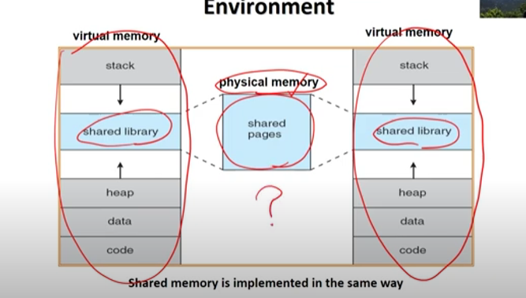
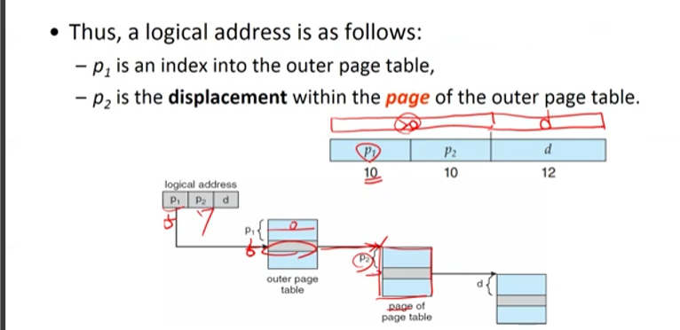
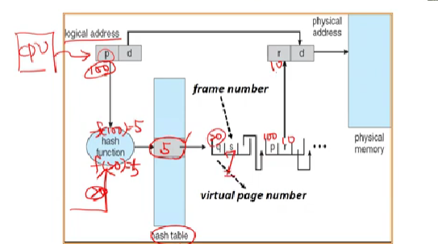
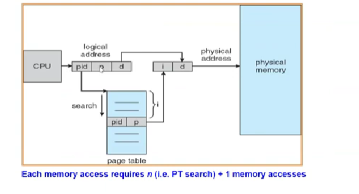

# Chapter 9

## Background
This markdown refers to 
- [**Chapter 9-1: Background-1**](https://www.youtube.com/watch?v=r6LkcFY093M&list=PLwD0kbgjHKhHaUh1mnJIuwm6otLQW3_UP&index=57)
- [**Chapter 9-1:  Background-2**](https://www.youtube.com/watch?v=e4mKfEFLHGc&list=PLwD0kbgjHKhHaUh1mnJIuwm6otLQW3_UP&index=58)
- [**Chapter 9-2: Contiguous Memory Allocation-1**](https://www.youtube.com/watch?v=e62l0H4DF6k&list=PLwD0kbgjHKhHaUh1mnJIuwm6otLQW3_UP&index=59)
- [**Chapter 9-2: Contiguous Memory Allocation-2**](https://www.youtube.com/watch?v=SkiBd48_80o&list=PLwD0kbgjHKhHaUh1mnJIuwm6otLQW3_UP&index=60)
- [**Chapter 9-3: Paging-1**](https://www.youtube.com/watch?v=0blgwJhNzfc&list=PLwD0kbgjHKhHaUh1mnJIuwm6otLQW3_UP&index=61)
- [**Chapter 9-3: Paging-2**](https://www.youtube.com/watch?v=wvKufjRuPmA&list=PLwD0kbgjHKhHaUh1mnJIuwm6otLQW3_UP&index=62)
- [**Chapter 9-3: Paging-3**](https://www.youtube.com/watch?v=nTAq0DJiHww&list=PLwD0kbgjHKhHaUh1mnJIuwm6otLQW3_UP&index=63)
- [**Chapter 9-3: Paging-4**](https://www.youtube.com/watch?v=lP6kctCLQHk&list=PLwD0kbgjHKhHaUh1mnJIuwm6otLQW3_UP&index=64)

- [**Chapter 9-4: Structure of the Page Table-1**](https://www.youtube.com/watch?v=OFT6iNXU3G8&list=PLwD0kbgjHKhHaUh1mnJIuwm6otLQW3_UP&index=65)
- [**Chapter 9-4: Structure of the Page Table-2**](https://www.youtube.com/watch?v=0hyaxZJ1TlU&list=PLwD0kbgjHKhHaUh1mnJIuwm6otLQW3_UP&index=66)
- [**Chapter 9-4: Structure of the Page Table-3**](https://www.youtube.com/watch?v=-Dwp9GlU-pU&list=PLwD0kbgjHKhHaUh1mnJIuwm6otLQW3_UP&index=67)
- [**Chapter 9-4: Swapping**](https://www.youtube.com/watch?v=JRQ-774Q15E&list=PLwD0kbgjHKhHaUh1mnJIuwm6otLQW3_UP&index=68)
---

### Memory Protection

#### 誰保護記憶體？
- **Answer:** 硬體

#### 怎麼檢查？
- **Answer:**
  1. **Base Register**  
  2. **Limit Register**  
     - (這兩個暫存器只有 OS 能填寫)
     - 屬於 **Privileged Instruction** （特權指令）

---

    

### 程式開發步驟
---
1. **source code** 編譯成 **object files**
2. **linker** 把 **object files** 結合成 **執行檔** 
3. **loader** 將 **program**  丟進 **memory** 裡面等待執行 

    

* **Address binding**: 從一個Address space轉道另一個Address space -> 變數轉換成記憶體位置就是binding

#### 甚麼時候做binding
- **Answer:**
    - **complier time:(SIC)**
      - 必須知道執行之後的在記憶體的位址是多少(沒有彈性) 👎
      - symbolic addresses **compile** 時轉成 absolute addresses (abc => 1424) 再 **link**
    - **loading time(SIC/XE)**
      - relocatable code 可以把 relocatable 位址 轉成 實際位址
      - symbolic address **compile** 轉成 relocatable address 再 **link** 跟 **load** 轉成 absolute address *load time 算出來實際的起始位址*
    - **execution time(x86)**
      - 需要hardware support
      - 當前裝置都是這樣 😊
      - CPU生成的位址跟memory看到的 ***不一樣***
      - **Logical address**: CPU 送出來的 virtual address (CPU定義)
      - **Physical address**: 經過轉換出來的真位址 (記憶體大小)
      - **MMU**: relocation register: 把CPU送出來的address加上relocation register獲得physical address

---

### Dynamic Loading
- Routine 只有在**呼叫**的時候才會載入
- 更好的 memory-space 利用率
  - 沒有使用的程式不會被載入
  - 當很多程式在處理不常發生的狀況(處理error)時，除非呼叫才載入，好用👍
### Dynamic Linking
- **Static Linking**: 
  - 大家都用同library時有重複檔案
- **Dynamic Linking**: 
  - link **先作假** 實際 call 的時候才會載入記憶體
  - 載入一次就好了，第二次即可共享

- **Static Linking v.s. Dynamic Linking**

    
    

## Contiguous Memory Allocation
* 最直覺的分配方式
- Memory Protection for **relocation and limit register**
  - hardware support
  - limit register: range of addresses
  - relocation register: **最小的 address**
  - MMU: **Logical address -> if < limit register then + relocation register -> physical address**
  - <mark><strong>OS 決定 Relocation 跟 Limit Registers 且 context switch 時會存他們，「save跟restore都會存取跟提取」</strong></mark>

    

- **Memory Allocation**
  - Used partition 
  - Free partition
  - Hole: used partition 被釋放
  - <mark>OS紀錄哪些使用到哪些沒使用</mark>
  - Merge: OS merge 隔壁的洞
  

      
  

  
  - External Fragmentation: process 離開的時候釋放掉的空間 -> 用哪個洞執行程式
    - First fit: 第一個夠大的
    - Best fit: 全部找完，最小的洞 
    - Worst fit: 全部找完，最大的洞
    <mark>First fit 跟 Best Fit 最好，<strong>First fit最快</strong></mark>

    - **50-percent rule**: 
      - N 個分配blocks 中 .5 N 會因Fragmentation 而無用 -> 1/3 memory 無法使用
      - **Sol 1. Compaction**: shuffle memory contents: 往上搬動來整理記憶體 -> 很耗時間
      - **Sol 2. Non-contiguous Memory Allocation**
    - **Non-contiguous**
      - **Internal Fragmentation**(memory internal to a partition): 因 memory 拆成特定大小的 Blocks **分配的 Block 會大於實際要求的空間**

## Paging
* 需 OS & hardware 的緊密合作
* 實現不連續記憶體 ( 解決External Fragmentation )

- **Idea**
  - **Physical Address**: 不連續
  - **Logically**: program 認為是連續
- **Method**
  - **切 Physical Memory 成 frames**: 4KB ~ 1GB (硬體定義)
  - **Logical/virtual memory (連續)** 切成 page
  - **使用 Page Table 轉換Logical Memory 成 Physical Memory**

- **Characteristics**
  - 沒有 **external fragmentation**
  - 有 **internal fragmentation**

- **Addresss Translation Scheme**
  - **Page Number(p)**: 查詢 Page Table {Page: Frame}
  - **Offset(d)**: 查詢 frame 裡面的 offset
  - CPU 產生的 address 切成 Page number 跟 Offset:
    
    $
    \text{Logical address} = m\, \text{bits} \newline
    \text{Page number} =  m - n \,\text{bits}\newline
    \text{Offset} = n \, \text{bits}
    $
- **誰 maintain Page Table**
  - **OS 產生 Page Table**
  - **MMU (the address translation hardware) 使用 Page Table** 做 Address 轉換
- **Free Frame List**
  - **OS 維護 Free Frame List**
  - 假設 Page Table 裡面已經有了，我就知道 Free Frame 哪些被拿出來

- **Frame Table**
  - **OS 維護 Frame Table** 來記錄 Frame 的使用情形: 哪些 frame 是 free，哪些放 process 

- **Per-Process Page Table**
  - **每個 Process 都有一個 Page Table** 紀錄其第幾個 Page 在哪個 Frame
  - Page Table 存在 **main memory** (也在記憶體裡面) 裡面
  - Hardware 引入兩個 registers:
    - **Page-table based register (PTBR)**
      - 指向 page table 位置
    - **Page-table length register (PTLR)**
      - 存放 page table 的長度
    - Context switch 也會 save & restore

- **Hardware Support For Paging**: 
  - **需要存取兩次問題**: (1) 存取 Page Table (2) 知道實際位置去抓資料
  - ***Ans: TLBs*** (Translation Look-aside Buffers): 常用的 **cached**
    - **TLB hit**: 直接抓 frame (時間近乎為零)
    - **TLB miss**: 查 page table
    - **TLB 滿了**: 剔除來取代
    - **Wired-down TLB entries**: 從來不會被剔除的 entries **kernel code** 通常是 wired down
      

        
      

    - **Context switch 時問題**:
      - **flush TLB**，否則會抓到別的 process 的記憶體空間 (frame 是別人的)
      - 紀錄 **ASIDs** (address-space identifiers) in each TLB entry: 用新的欄位看 entry 屬於哪個 process，假設並非當前 process 的， TLB miss
    - **Hit Ratio**: percentage of times that a page number is found in TLB
      - 假設 memory accesss time = 10 ns
        - TLB miss: access time = 10 + 10 = 20 ns
        - TLB hit: access time = 10 ns
      - 若 hit ratio = 80%
        - Effective Accesss Time(EAT)
          $
            \text{EAT} = 0.8 \times 10 \, + \, 0.2 \times 20 = 12 \, \text{ns}
            \newline
            \text{if } EAT = 100\%, \text{ then it experiences a 20\% slowdown in memory access time.}
          $
        - 真實 Hit ratio 為 99% -> 1% slowndown

- **Incorporate Memory Protection in Paging**
  - **Process 存取外部的 Page**
    - **Protection Bit** (valid-invalid bit in a Page Table): virtual address space 有 8 pages 但程式只使用 4 pages
      - **Valid**: 合法，可以存取 frame
      - **Invalid**: 不合法，不屬於他的記憶體空間拒絕，跳到 OS 產生 trap
      - Example: 
      $
      \text{14-bit logical address, and the page size is 2KB}\newline
      \text{page size} = 2^{10} \times 2 = 2^{11} \newline
      \text{number of entries} = \frac{2^{14}}{2^{11}} = 2^3 = 8\newline
      \text{if the program only takes 6 pages, there are 2 pages marked as invalid.}\newline
      \text{Any access to it causes a trap}
      $
    - **很多 invalid 資料** :
      - Page-table length register (PTLR): **只要記錄 valid 的部分就好，超過就丟 trap**
    - **Fine-grained protection**
      - 更多 protection bit: 
        - valid-invalid 
        - read-write, read-only, execute-only

- **Shared Pages**: 只要一份 *Shared Code* 在 *Physical Memory* 就好
  - 常被共享的程式
    - Heavily used programs: compiler, window systems, database systems
    - Shared Libraries
    - IPC shared memory
  - **How ?** A: 讓 Page Table 的 entry **「一樣」** 就好😊
  

          
  

## Strcuture of the Page Table
* 過大的 Page Table
* E.g.

  $
    \text{32-bit logical address space, 4 bytes for each entry, and 4KB Page size} \newline
    \text{Page Table Size} = \frac{2^{32}}{2^{12}} \times 2^{2}\, \text{bytes} = 4 \text{MB} \text{ (the same size as 1024 frames) -> Contiguous Memory Allocation Issue}
  $

- **Hierarchical Page Table**
  - **Two-level page table** (a.k.a. Forward-mapped page table)
    - 利用將 **contiguous 的區段分散至 inner space 來解決「超大 contiguous space」 問題**
    - Outer page table: <mark>Contiguous</mark>
    - Page table <mark>(non-contiguous)</mark>
    - memory <mark>(non-contiguous)</mark>
    - e.g.

      $
        \text{32-bit machine with 4K page size} \newline
        \text{Page Numbers: 20 bits} \newline
        \text{Page Offset: 12 bits} \newline 
        \text{Page Number Bits} = P_1\text{'s 10 bits} + P_2\text{'s 10 bits} \newline
        P_2 \text{ has } 2^{10} \text{ entries}
      $

    

      
    

  - 多次存取記憶體
- **Hashed Table**
  - 問題 collision
  - 方法 
    - Virtual page number
    - Frame number 
    - Pointer to the next hash entry
    

      
    

- **Inverted Hash Table**
  - 紀錄每個 Frame **在哪個 Page**
  - **system-wide page table** 只要一個 page table 而非 per-process page table，依照 physical memory 去建構
  - 包括
    - Process-id
    - Virtual page number
    

      
    

    - **缺點: 一個一個找**，找到之後利用位置(第幾個)來查 frame number
    - O(n)
    - 可以用 hash table 來減少
    - 難以做到 shared memory

## Swapping
- **Swap out**: 把 processes 從 memory 移動到 backing store
  - Reduce the degree of multiprogramming
- **Swap in**: 把 processes 重新移動回 memory
  - Increase the degree of multiprogramming
- 好處
  - 系統比我們 **phsyical memory 可以容納的**還要可以容納 **更多** processes
- Backing store
  - 作為 swap space (swap out 放的地方)，通常為 disk partition
- Candidates for swapping out
  - Idle or mostly idle processes
