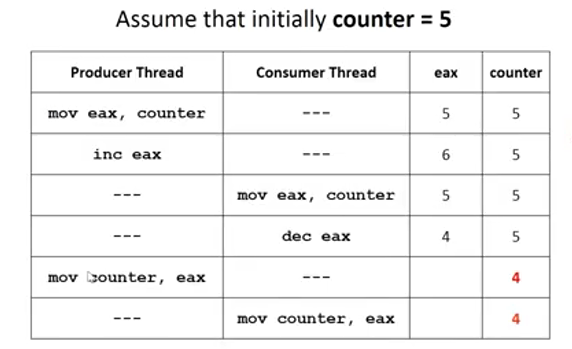

# Perterson's Solution

## 正常的狀況

 

## 對調 turn 跟 flag[] 的情況

# Hardware Solutions

## Disable Interrupts

### 原本 Race Condition 的問題

### Disable 來解決

## Memory Barriers

### Reorder 的狀況

### test_and_set

### Lock = false 不用 atomic

### Lock and bounded waiting

# Liveness

# Paging

## TLB

## read-write bits

## Two level paging

## Hashed Page Table

## IPT

## Demand Paging

## Copy on write

# Belady Anomaly

# LRU time-of-use

# Page Replacement

# Page Buffering

# Reclaiming Pages

# Thrashing

