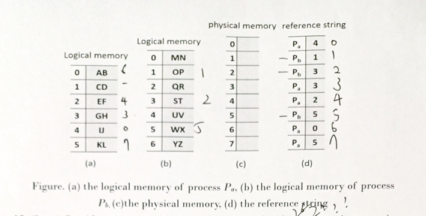

# **Question Set**

---
## **1. Classical Race Condition (4 pts)**

**Question:**  
A classical solution to race condition is to associate a variable called `lock`. The following code is used to check if we can enter the critical section or not. Why is this solution incorrect?  

```c
lock = 0;
while (lock != 0);
lock = 1;
// Critical Section
lock = 0;
```
<textarea rows="10" cols="50"> </textarea>


---

## **2. Critical Section Problem (6 pts)**

**Algorithm Overview:**  
The algorithm uses an array of two flags, where `flag[0]` and `flag[1]` indicate if processes 0 and 1 are in their critical sections, respectively. Below is the algorithm for process 0:

```c
WHILE (flag[1] == 1)
   DO nothing
ENDWHILE
flag[0] = 1;

critical section

flag[0] = 0;

remainder section
```

**Questions:**
| Part | Description | Points |
|------|-------------|--------|
| (a)  | Give an example (execution sequence) to demonstrate that the algorithm is incorrect. | 4 pts |
| (b)  | Does your example in (a) result in a deadlock? Explain your answer. | 2 pts |

---

<textarea rows="10" cols="50"> </textarea>

## **3. Busy Waiting & Spin Lock (6 pts)**

**Questions:**  
| Part | Description | Points |
|------|-------------|--------|
| (a)  | What’s the drawback/problem of busy waiting? | 2 pts |
| (b)  | Why is spin lock useless in single-processor systems? | 2 pts |
| (c)  | Why is spin lock inappropriate for long critical sections in multi-processor systems? | 2 pts |

---

<textarea rows="10" cols="50"> </textarea>

## **4. Reader-Writer Locks vs Semaphores (4 pts)**

**Question:**  
In what scenarios would you opt for a reader-writer lock instead of a semaphore? Explain.

---

<textarea rows="10" cols="50"> </textarea>

## **5. Modified Peterson’s Solution (4 pts)**

**Question:**  
Why is the following modification of Peterson’s solution incorrect? Provide an example to demonstrate.  

```c
do {
    flag[i] = TRUE;  // I first
    turn = i;
    while (flag[j] && turn == j);

    // CRITICAL SECTION

    flag[i] = FALSE;  // exit

    // REMAINDER SECTION
} while (TRUE);
```

---

<textarea rows="10" cols="50"> </textarea>

## **6. Semaphore Operations (6 pts)**

**Questions:**  
| Part | Description | Points |
|------|-------------|--------|
| (a)  | Why should you not manually update the semaphore value? | 3 pts |
| (b)  | Why should you use `wait()` and `signal()` system calls instead? | 3 pts |

---

<textarea rows="10" cols="50"> </textarea>

## **9. Dirty-Bit in Virtual Memory Management (9 pts)**

**Questions:**  
| Part | Description | Points |
|------|-------------|--------|
| (a)  | How to use the dirty bit to reduce page fault overhead? | 3 pts |
| (b)  | Who sets the dirty bit and when? | 3 pts |
| (c)  | Who clears the dirty bit and when? | 3 pts |

---

<textarea rows="10" cols="50"> </textarea>

## **10. Stack Algorithm (4 pts)**

**Question:**  
Explain the property or definition of the **stack algorithm** in page replacement.

---

<textarea rows="10" cols="50"> </textarea>

## **11. One-Level Page Table (10 pts)**

**Scenario:**  
Assume one-level page table, following figure shows the logical memory of process $P_a$, logical memory of process $P_b$, the content of physical memory (initialially empty), and the reference strings of processes $P_a$ and $P_b$. Ignore the memory space used by the page table. Assume that, initially, the free frame list is: 0, 1, 2, 3, 4, 5, 6, and 7. After completing the execution of the reference string.

<center> </center>
Answer the following:  

| Part | Description | Points |
|------|-------------|--------|
| (1)  | Show the page table of process Pa with valid-invalid bits. | 2 pts |
| (2)  | Show the content of physical memory. | 2 pts |
| (3)  | Show the inverted page table. | 2 pts |
| (4)  | Why is address translation using an inverted page table more time-consuming? | 2 pts |
| (5)  | Show the new content of physical memory when process Pb accesses page 2 (global LRU). | 2 pts |

---

<textarea rows="10" cols="50"> </textarea>

## **12. Memory Accesses & TLB (9 pts)**

**Scenario:**  
A system with 8-bit addresses and 16-byte pages processes logical addresses with TLB and LRU policies.

**Questions:**  
| Part | Description | Points |
|------|-------------|--------|
| (a)  | Which memory accesses result in a TLB miss? | 3 pts |
| (b)  | Which memory accesses result in a page fault? | 3 pts |
| (c)  | Which physical address is accessed upon logical address 60? | 3 pts |

---

<textarea rows="10" cols="50"> </textarea>

## **13. Page Faults in Replacement Algorithms (6 pts)**

**Question:**  
Given the reference string:  
`1, 2, 3, 4, 2, 1, 5, 6, 2, 1, 2, 3, 7, 6, 3, 2, 1, 2, 3, 6`  
Calculate the number of page faults for the following algorithms with five frames:  

| Part | Algorithm | Points |
|------|-----------|--------|
| (a)  | LRU Replacement | 2 pts |
| (b)  | Optimal Replacement | 2 pts |
| (c)  | LFU Replacement | 2 pts |

---

<textarea rows="10" cols="50"> </textarea>

## **14. Locality Types (8 pts)**

**Question:**  
For the variables in the following code, indicate their type of locality:  

```c
b = 2045;
i = 1;
x[i] = i;
while (i < 1000) {
    a = y[300];
    b = z[i] + c;
    c = c + w[i+500] + y[i];
    i = i + 1;
}
```

| Variable | Locality Types                         |
|----------|----------------------------------------|
| `a`      | Spatial / Temporal / No Locality       |
| `b`      | Spatial / Temporal / No Locality       |
| `w`      | Spatial / Temporal / No Locality       |
| `x`      | Spatial / Temporal / No Locality       |

---

<textarea rows="10" cols="50"> </textarea>

## **15. Impact of Increased Page Size (8 pts)**

**Questions:**  
| Metric                           | Expected Change | Explanation | Points |
|----------------------------------|-----------------|-------------|--------|
| (a) Size of the page table       | Increase/Decrease/No Change |         | 2 pts |
| (b) Internal fragmentation       | Increase/Decrease/No Change |         | 2 pts |
| (c) Number of page faults        | Increase/Decrease/No Change |         | 2 pts |
| (d) TLB hit rate                 | Increase/Decrease/No Change |         | 2 pts |

---

<textarea rows="10" cols="50"> </textarea>

## **16. Counting-Based Replacement Algorithms**

**Question:**  
Why are counting-based replacement algorithms uncommon?

---

<textarea rows="10" cols="50"></textarea>
